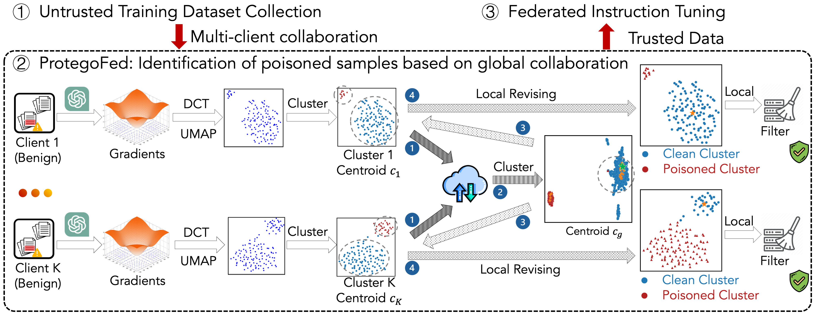

# ProtegoFed

<div align="center">
  <h2 align="center">ProtegoFed: Backdoor-Free Federated Instruction Tuning with Interspersed Poisoned Data</h2>
  <a href="https://arxiv.org/abs/2603.00516" style="display: inline-block; text-align: center;">
      
  </a>
</div>

<div align="center">
  <a style="display: inline-block; text-align: center;">
      
  </a>
</div>


# Environment Setup

## Create Virtual Environment

```bash
# Create conda environment
conda create -n protegofed python=3.10.16  
conda activate protegofed
```
## Install Dependencies

```bash
# Install basic dependencies
pip install -r requirements.txt
```


* Training Data. We provide the raw datasets in [./datasets/QuestionAnswering](./datasets/QuestionAnswering/).


# Usage

```bash
    python xxx.py --config_path=./genConfigs/xxx.json --poisoner=xxx
```

# Acknowledgement

This work could not have been completed without the help of the following repositories:

- OpenBackdoor: https://github.com/thunlp/OpenBackdoor
- PEFT: https://github.com/huggingface/peft
- GraCeFul: https://github.com/ZrW00/GraceFul

# Citation

```ruby
@misc{zhao2026protegofed,
      title={ProtegoFed: Backdoor-Free Federated Instruction Tuning with Interspersed Poisoned Data}, 
      author={Haodong Zhao and Jinming Hu and Zhaomin Wu and Zongru Wu and Wei Du and Junyi Hou and Caibei Zhao and Zhuosheng Zhang and Bingsheng He and Gongshen Liu},
      year={2026},
      eprint={2603.00516},
      archivePrefix={arXiv},
      primaryClass={cs.CR},
      url={https://arxiv.org/abs/2603.00516}, 
}
```